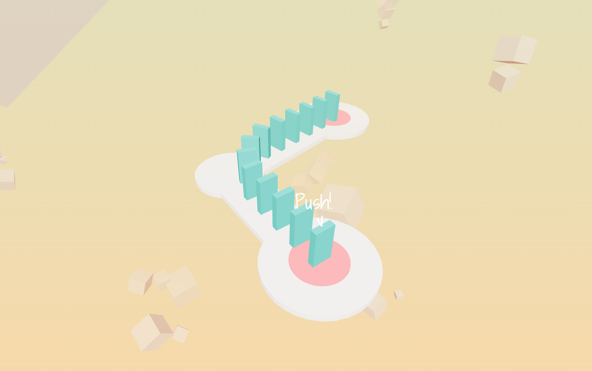
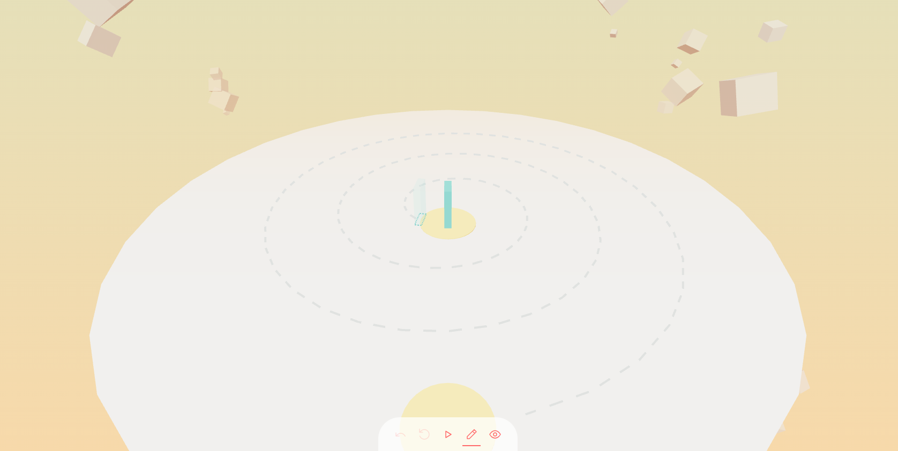

# Domino Quest

Welcome to **Domino Quest**! 🎉

Play the game here 👉 [https://tommyinb.github.io/domino-quest/](https://tommyinb.github.io/domino-quest/)



I embarked on this project to dive into the React + ThreeJS framework, r3f. This handy framework lets us render 3D graphics using React's coding style, significantly boosting coding efficiency.

## React Style

With r3f, the React tree is translated into ThreeJS code, allowing us to handle 3D scenes and 3D objects just like regular HTML elements. This means we can manage them with React components seamlessly.

```tsx
<div className="App">
  <LanguageProvider>
    <SceneProvider>
      <Suspense>
        <Scene>
          <Controller />
        </Scene>
      </Suspense>

      <Title />
      <Success />
      <Failure />
      <Footer />
    </SceneProvider>
  </LanguageProvider>
</div>
```

### Big Benefit

As shown above, the 3D scene is rendered by `<Scene>` component. Simultaneously, we can include all other components, such as `<Footer>`, on the same page. These elements can freely communicate using the context mechanism, resulting in a unified and well-structured project.



### Small Flaw

Due to the complexity of implementation, the author of r3f decided not to preserve the React tree after transitioning from 3D back to HTML. This means that while HTML child elements can be rendered inside 3D parent elements without visible issues in browser layer, the child HTML loses the ability to trace back to its 3D parent in React layer. This is understandable since r3f nonetheless translates the React tree into ThreeJS code instead of the DOM tree. Mimicking the hierarchy would be challenging and hard to maintain. Most developers likely do not notice this loss. Despite this minor flaw, r3f is nearly perfect for me.

## The Game

The game consists of 10 levels, each teaching the player different techniques. Similarly, I learned to code various things level by level.

Hope you enjoy it! 👉 [https://tommyinb.github.io/domino-quest/](https://tommyinb.github.io/domino-quest/)
